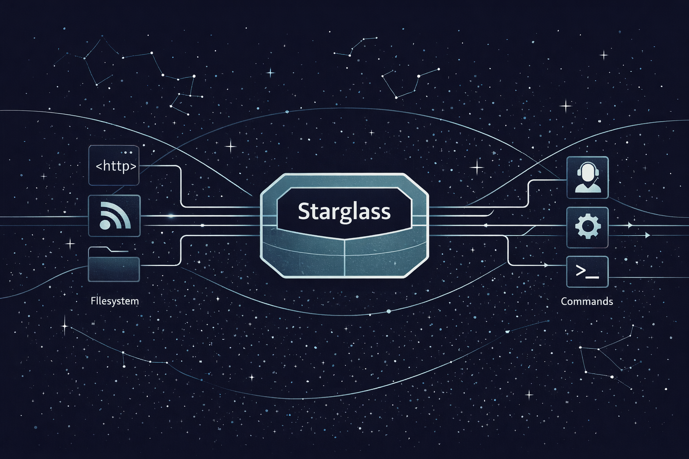

<p align="center">
  
</p>

# Starglass

Starglass is an observation runtime for agent systems.

It gives AI research and agent infrastructure teams a clean way to watch external state, turn meaningful change into normalized events, and resume safely across long-lived runs, cron jobs, and restarts.

In practice, Starglass handles the hard, boring parts of observation-heavy systems:
- poll-cycle execution
- normalized event envelopes
- compact checkpointing
- duplicate suppression
- dispatch to commands or in-process handlers
- explicit observation planning and adaptive cadence
- generic source families for HTTP, feeds, and the filesystem

You supply the source-specific meaning. Starglass supplies the runtime discipline.

That source can be a status API, an evaluation artifact, an RSS or Atom feed, a filesystem tree, a queue, a database row, a private internal endpoint, or some cursed research prototype that only made sense at 1:14am. Starglass should not care.

## Why this exists

Most agent systems eventually need the same substrate:
- observe changing state outside the model
- detect meaningful deltas rather than raw churn
- survive restarts without replaying junk
- preserve a compact resume point
- hand off normalized events to downstream automation

Teams often rebuild that machinery inside each connector, cron, or worker. The result is usually fragile, provider-specific, and impossible to reason about once the system grows.

Starglass separates the observation problem from the business-logic problem.

## What Starglass is for

Starglass fits best when you are building:
- agent or research pipelines that monitor external systems for meaningful change
- evaluation or observability loops that need deterministic event identity
- long-lived background watchers with restart-safe checkpointing
- source-agnostic monitoring primitives for internal AI tooling
- lightweight ingestion layers that should emit stable events, not raw payload archives

## Boundary

Starglass owns:
- watcher lifecycle
- poll execution and restart-safe resumption
- normalized event contracts
- compact checkpointing and dedupe
- explicit observation planning and strategy selection
- bounded adaptive cadence for long-lived watch loops
- generic HTTP, feed, and filesystem observation primitives
- dispatch primitives

Starglass does not own:
- a branded connector catalog
- provider-specific business policy
- workflow orchestration
- deciding what an agent should do next
- mutating external systems
- pretending every source should look like a SaaS integration marketplace

## Mental model

1. Define an observation target.
2. Implement a `SourceAdapter` for that target, or use a built-in adapter.
3. Let `ObservationRuntime` resolve the observation plan, execute the poll, and persist compact state.
4. Handle the normalized event envelope downstream in your agent, worker, or CLI.

The key idea is simple: adapters decide what changed, Starglass decides how to observe and resume it safely.

## Minimal usage

```ts
import {
  CommandDispatchAdapter,
  FileCheckpointStore,
  ObservationRuntime,
  type CheckpointRecord,
  type ObservationEvent,
  type ObservationTarget,
  type SourceAdapter,
} from 'starglass'

type BuildTarget = ObservationTarget & {
  source: 'buildkite'
  pipeline: string
}

class BuildkiteSourceAdapter implements SourceAdapter<BuildTarget> {
  readonly source = 'buildkite'

  async poll(target: BuildTarget, checkpoint?: CheckpointRecord) {
    const events: ObservationEvent[] = []

    return {
      events,
      providerCursor: checkpoint?.providerCursor,
      polledAt: new Date().toISOString(),
    }
  }
}

const runtime = new ObservationRuntime({
  sourceAdapter: new BuildkiteSourceAdapter(),
  checkpointStore: new FileCheckpointStore('./.starglass/checkpoints.json'),
  dispatchAdapters: [new CommandDispatchAdapter()],
})

await runtime.poll({
  id: 'buildkite:acme/release',
  source: 'buildkite',
  subject: 'buildkite:acme/release',
  pipeline: 'acme/release',
  dispatch: {
    kind: 'command',
    command: 'node',
    args: ['./handle-event.js'],
  },
})
```

The command target receives a normalized JSON envelope on stdin.

## Built-in observation families

Starglass includes built-in adapters for common source families:
- `HttpObservationAdapter` for generic JSON and HTML resources
- `FeedObservationAdapter` for RSS and Atom resources
- `FileSystemObservationAdapter` for files and directories

These all use the same runtime machinery: planning, compact checkpointing, normalized projection diffing, duplicate suppression, and dispatch.

## Strategy-aware observation

Starglass can now resolve an explicit observation plan from declared capabilities.

Priority order:
1. push
2. conditional request
3. cursor
4. cheap probe then fetch
5. projection diff
6. snapshot diff fallback

Adapters can expose capabilities with `capabilities()`, and targets can add `observationCapabilities` hints. The runtime resolves a compact `ObservationPlan` before execution, including the selected strategy, the merged planning inputs, the previous strategy when one existed, and whether the plan is initial, unchanged, upgraded, or degraded.

For generic HTTP, Starglass starts honestly in projection-diff mode until it learns validators from a prior response, then upgrades to conditional mode on later polls. If stronger resumable state disappears after restart or replanning, the runtime records that degradation explicitly instead of pretending the stronger mode is still active. The checkpoint stays compact, but callers can inspect the current plan through hooks or persisted observation metadata.

## Generic HTTP observation

Starglass includes a built-in `HttpObservationAdapter` for generic JSON and HTML resources, aimed at the common case where you need reliable change detection without building a bespoke connector first.

It supports:
- conditional `ETag` and `Last-Modified` reuse once validators are learned
- minimal `Retry-After` and `Cache-Control: max-age` hint capture in compact checkpoint metadata
- normalized JSON projection diffing
- normalized HTML extraction diffing
- compact checkpoint state with validators, next-poll hints, and fingerprints
- no raw response body retention by default

### JSON example

```ts
import {
  FileCheckpointStore,
  HttpObservationAdapter,
  ObservationRuntime,
} from 'starglass'

const runtime = new ObservationRuntime({
  sourceAdapter: new HttpObservationAdapter(),
  checkpointStore: new FileCheckpointStore('./.starglass/http-checkpoints.json'),
  dispatchAdapters: [
    {
      supports(target) {
        return target.kind === 'handler'
      },
      async dispatch(envelope) {
        console.log('meaningful change', envelope.event.payload.projection)
      },
    },
  ],
})

await runtime.poll({
  id: 'http:json:status',
  source: 'http',
  subject: 'http:https://status.example.com/api/summary',
  url: 'https://status.example.com/api/summary',
  format: 'json',
  project: (document) => {
    const payload = document as {
      status: { indicator: string; description: string }
      page: { updated_at: string }
    }

    return {
      indicator: payload.status.indicator,
      description: payload.status.description,
      updatedAt: payload.page.updated_at,
    }
  },
  dispatch: {
    kind: 'handler',
    handler: async (envelope) => {
      console.log('observed projection', envelope.event.payload.projection)
    },
  },
})
```

For HTML targets, replace `format: 'json'` and `project()` with `format: 'html'` and `extract()`.

You can keep projection authoring small and generic with the built-in helpers:

```ts
import { html, normalize, projectJson } from 'starglass'

const projectStatus = projectJson.shape({
  indicator: projectJson.path('status', 'indicator'),
  description: projectJson.path('status', 'description'),
  updatedAt: projectJson.path('page', 'updated_at'),
})

const stableProjection = normalize.stable({
  noisyField: undefined,
  meaningful: projectStatus(document),
})

const extractHeadline = html.extract((document) => ({
  headline: document.match(/<h1>(.*?)<\/h1>/)?.[1] ?? null,
}))
```

These helpers stay intentionally narrow: Starglass helps define a stable observed projection, but your business policy still decides what that projection means downstream.

See `examples/http-observation/README.md` for a focused example.

## Adapter authoring guidance

A good adapter does five things consistently:

1. Chooses one durable `subject` per watched thing.
2. Derives deterministic event ids from provider identity plus the meaningful state transition.
3. Uses a provider cursor or compact validators that can safely resume polling after restarts.
4. Filters raw provider noise down to meaningful normalized events before returning them.
5. Keeps normalized payloads small, stable, and downstream-friendly.

### Subject identity

`target.subject` is the stable identity of the thing being watched, not the identity of one individual event.

Good subjects usually look like:
- `linear:team-123:issue:ABC-42`
- `rss:https://example.com/feed`
- `example.buildkite:acme/release:main`
- `http:https://status.example.com/api/summary`

Use a subject that stays stable across polls and process restarts. If downstream systems should think of two observations as "the same thing", they should share a subject.

### Event ids

`event.id` should be deterministic. If the same upstream change is observed twice, the adapter should produce the same event id so Starglass can suppress duplicates safely. The built-in HTTP adapter keys event ids to the normalized projection fingerprint, which means a later return to a previously seen state reuses the same id by design. Feed entry events instead key off the stable subject, entry id, and the same meaningful revision signal used for feed change detection, so a meaningful re-emit gets a fresh event id even when the projected payload fingerprint stays the same.

A practical rule is: hash the stable subject, normalized event kind, provider object id, and provider update/version marker.

```ts
const id = stableEventId(target.subject, kind, providerObjectId, providerUpdatedAt)
```

Do not use random ids for provider-backed changes. Random ids defeat duplicate suppression.

### Provider cursor and compact state strategy

`providerCursor` is the adapter-owned resume token. Starglass stores it, but your adapter defines what it means.

Good resumable state is usually one or more of:
- a monotonic provider timestamp
- a provider sequence number
- a page token or opaque checkpoint returned by the provider
- HTTP validators like `ETag` or `Last-Modified`
- a compact fingerprint of the last meaningful projection
- optional next-poll hints derived from generic transport metadata like `Retry-After` or `Cache-Control: max-age`

Choose state that lets the next poll ask "what changed since the last successful run?" without storing whole payload archives.

### Meaningful-change filtering

Adapters should do provider-specific filtering before returning events.

Examples:
- ignore build updates unless the state enters `failed`, `passed`, or another watched terminal state
- ignore issue updates that only change unread counts or internal metadata
- ignore feed entries outside the configured category or policy
- ignore JSON or HTML churn that does not change the normalized observed projection

Starglass handles dispatch, checkpointing, duplicate suppression, and compact strategy state. The adapter should decide which upstream changes are meaningful enough to become normalized events.

### Normalized payload boundaries

`event.payload` should contain the downstream-useful summary of the change, not a full raw provider response dump.

Good payloads usually include:
- the fields downstream automation actually needs
- normalized names and shapes
- a human-readable summary when helpful
- provider-native ids or URLs only when they help follow-up work

Keep bulky or unstable provider details out of the normalized payload when possible. Put traceable provider identity in `sourceRef`.

### External-style examples

See:
- `examples/external-adapter/` for a custom external adapter
- `examples/http-observation/` for generic HTTP observation
- `examples/feed-observation/` for generic RSS/Atom observation
- `examples/filesystem-observation/` for generic filesystem observation

## Long-lived watchers and hooks

```ts
const controller = runtime.watch(target, {
  intervalMs: 30_000,
  backoffMs: 5_000,
  maxBackoffMs: 60_000,
  maxConsecutiveFailures: 5,
  cadence: {
    minIntervalMs: 10_000,
    maxIntervalMs: 120_000,
    activityMultiplier: 0.5,
    idleMultiplier: 1.5,
    maxIdleDelayMs: 90_000,
  },
})

await controller.stop()
```

Starglass now plans the next attempt inside the watch loop itself. It uses compact observation metadata like `Retry-After`, `Cache-Control: max-age`, recent activity, and idle streaks, but always clamps the result to caller-supplied cadence bounds.

That execution cadence is separate from observation-plan selection. Plan selection decides how a target will be observed. The watch loop then executes that plan and schedules the next attempt.

You can also attach structured hooks without coupling Starglass to a logger or metrics backend:

```ts
const runtime = new ObservationRuntime({
  sourceAdapter,
  checkpointStore,
  dispatchAdapters,
  hooks: {
    onPollStarted: ({ target }) => console.log('poll started', target.id),
    onObservationPlanSelected: ({ plan }) => {
      console.log('strategy', plan.strategy.mode, plan.strategy.reason, plan.change.kind)
    },
    onDispatchSucceeded: ({ event }) => console.log('dispatch ok', event.id),
    onDispatchFailed: ({ event, error }) => console.error('dispatch failed', event.id, error),
    onCheckpointAdvanced: ({ reason, record }) => console.log('checkpoint', reason, record.observationTargetId),
    onWatchBackoff: ({ consecutiveFailures, delayMs }) => console.warn('backing off', consecutiveFailures, delayMs),
    onWatchCadencePlanned: ({ reason, delayMs, nextAttemptAt, boundedBy }) => {
      console.log('next attempt', reason, delayMs, nextAttemptAt, boundedBy)
    },
    onWatchStopped: ({ reason }) => console.log('watch stopped', reason),
  },
})
```

`onWatchCadencePlanned` exposes structured, logger-agnostic observability so callers can inspect why a target sped up, slowed down, deferred for freshness hints, or stayed pinned to configured bounds.

The existing `poll()` API remains available for one-shot or job-style usage.

## Release discipline

See `docs/release.md` for the release checklist and packaging contract.

Key commands:
- `npm run verify:packaging` checks the tarball file list and performs a clean install/import smoke test
- `npm run release:check` runs the full local release verification sequence

## Generic feed and filesystem observation

Starglass also includes built-in source families for feeds and the filesystem, using the same planning, checkpointing, dedupe, and projection primitives as HTTP. The goal is not to ship a connector zoo. The goal is to prove the runtime generalizes cleanly across source families that show up constantly in agent and research workflows.

- `FeedObservationAdapter` observes RSS and Atom resources through a small bounded XML tag parser, normalized entry projections, and compact per-entry state that tracks entry content revision separately from projected output.
- `FileSystemObservationAdapter` observes files or directories through normalized projection diffs and stores compact fingerprints rather than raw archives.

Feed defaults are intentionally conservative: Starglass stores a compact entry-content revision fingerprint separately from the projected payload, so meaningful entry updates still emit when timestamps stay fixed and your projection intentionally omits volatile body fields. The default version signal comes from `updatedAt`, then `publishedAt`, then that compact content fingerprint. Feed event ids are derived from the entry id plus a compact revision signal that combines that version with the entry-content fingerprint, so unchanged-timestamp RSS body edits still get distinct event ids without bloating checkpoint state. You can override `entryVersion` when a feed exposes a better revision marker.

Filesystem observation is projection-oriented, not archival. File targets still read `text`, `json`, or raw `bytes`. Directory targets with `includeContent: true` return UTF-8 text when content decodes cleanly, otherwise they expose base64 content with `contentEncoding: 'base64'` so binary files are represented honestly instead of being silently mangled.

Both stay source-agnostic. They are meant to be solid generic observation primitives, not thinly disguised product-marketing connectors.

## Status

Current release: `v0.2.1`

Implemented today:
- observation runtime with restart-safe file-backed checkpointing
- deterministic duplicate suppression and normalized event envelopes
- command and in-process handler dispatch
- long-lived watch loops with lifecycle hooks
- explicit observation planning and bounded adaptive cadence
- generic HTTP observation for JSON and HTML
- generic RSS/Atom feed observation
- generic filesystem observation
- release verification and trusted publishing support
